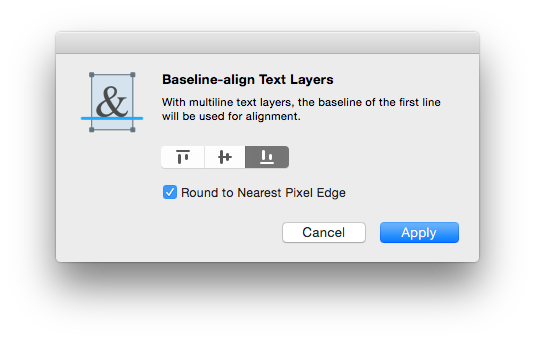

# BaseAlign
A Sketch Plugin to align Text Layers by their baselines.

## Installation  
[Download](https://github.com/abynim/BaseAlign/archive/master.zip) and extract the contents of this repository. Then double-click the BaseAlign.sketchplugin bundle to install the plugin. This will only work if you are using Sketch 3.3 or later.

## Usage  
1. Select two or more Text Layers and run the plugin.  
2. In the configuration window, select the edge you want to anchor the layers to, and hit __Apply__.  

## Shortcut  
Once you've installed the plugin and run it at least once, you can trigger it again using `Command` + `Shift` + `b`.

---

Send your love and feedback via [Twitter](http://twitter.com/abynim).

MIT License © Aby Nimbalkar.